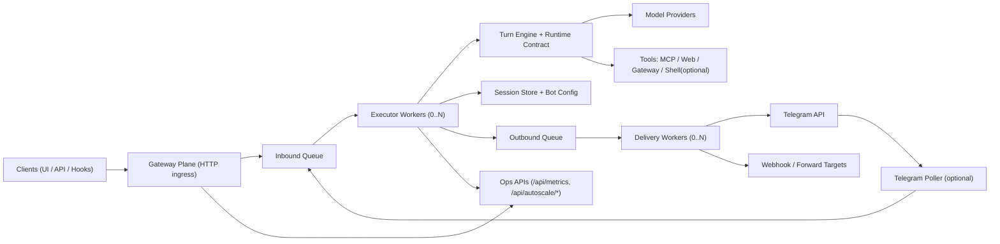

# SimpleAgent

SimpleAgent is an OSS multi-tenant agent runtime built for a queue-first serverless architecture.

It supports:
- a split runtime (`gateway`, `executor`, `telegram-poller`)
- async queue + dead-letter recovery
- explicit runtime contract endpoints (`/v1/health`, `/v1/capabilities`, `/v1/turn`)
- `bot_id` tenant isolation across ingress, memory, tools, and delivery

## Why This Architecture

SimpleAgent is designed so ingress stays available while compute scales independently:
- Gateway accepts requests and writes queue events quickly.
- Executor and delivery workers are stateless and can scale from `0..N`.
- Queue depth + lag metrics expose autoscaling signals.
- Failures are retried with backoff and moved to dead-letter for replay/purge.

This is the current architecture implemented in `app.py` and split entrypoints.

## Current Serverless Runtime Topology



## Quick Start (Single Process)

`app.py` auto-loads `.env` in the working directory.

1. Install dependencies:

```bash
uv sync --frozen
```

2. Create `.env` (minimal example):

```bash
PORT=18789
SIMPLEAGENT_DB_PATH=./simpleagent.db
SIMPLEAGENT_MODEL=gpt-4o-mini
SIMPLEAGENT_SERVICE_MODE=all
SIMPLEAGENT_WEB_ENABLED=1
SIMPLEAGENT_SHELL_ENABLED=0
OPENAI_API_KEY=replace-with-your-openai-api-key
```

3. Run:

```bash
uv run python app.py
```

4. Open:
- Chat UI: `http://127.0.0.1:18789/`
- Ops UI: `http://127.0.0.1:18789/ops`

## Split Runtime Deployment (Serverless Style)

Use separate processes with a shared DB:

- Gateway: ingress only
- Executor: queue drain + inference + tools + outbound delivery
- Telegram poller: Telegram `getUpdates` adapter (optional)

Entrypoints:
- `python run_gateway.py`
- `python run_executor.py`
- `python run_telegram_poller.py`

Docker split compose:

```bash
docker compose -f docker-compose.split.yml --env-file .env up -d --build
```

This starts:
- `simpleagent-gateway`
- `simpleagent-executor`
- `simpleagent-telegram-poller`

## Runtime Contract (for Control Planes)

SimpleAgent exposes a stable runtime surface:
- `GET /v1/health`
- `GET /v1/capabilities`
- `POST /v1/turn`

Contract defaults:
- `runtime_contract_version: v1`
- `tools_protocol: tool-tag-v1`

`/v1/turn` behavior:
- `service_mode=all`: executes turn immediately and returns assistant output.
- `service_mode=gateway|executor`: queues the turn and returns `202 status=queued`.

## Core APIs

### Bot + Chat
- `POST /api/bots`, `GET /api/bots`, `GET /api/bots/<bot_id>`, `POST /api/bots/<bot_id>/config`
- `POST /api/chat`
- `GET /api/sessions`, `GET /api/sessions/<session_id>`, `DELETE /api/sessions/<session_id>`

### Queue + Reliability
- `GET /api/queue/stats`
- `POST /api/queue/process-once`
- `GET /api/queue/dead-letter`
- `POST /api/queue/dead-letter/replay`
- `POST /api/queue/dead-letter/purge`

### Health + Autoscaling Signals
- `GET /health`
- `GET /livez`, `GET /readyz`, `GET /api/livez`, `GET /api/readyz`
- `GET /api/metrics`
- `GET /api/autoscale/signals`
- `GET|POST /api/autoscale/recommendation`

## Multi-Tenant Guardrails

- `bot_id` is required for tenant-scoped ingress and execution.
- Telegram bot token is unique across bots.
- Telegram owner claim is immutable after first sender.
- Queue/session records are scoped per `bot_id`.

## Telegram

1. Create a bot with `POST /api/bots`.
2. Set `telegram_bot_token` via `POST /api/bots/<bot_id>/config`.
3. Run with polling (`SIMPLEAGENT_TELEGRAM_POLLER_ENABLED=1`) or use webhook endpoints.
4. Send messages to your Telegram bot.

Session mapping format: `telegram:<chat_id>`.

## Operations Docs

- Architecture plan: [`docs/MULTI_USER_ARCHITECTURE_PLAN.md`](docs/MULTI_USER_ARCHITECTURE_PLAN.md)
- Split runtime runbook: [`docs/SPLIT_RUNTIME_RUNBOOK.md`](docs/SPLIT_RUNTIME_RUNBOOK.md)
- VM deploy notes: [`DEPLOY_VM.md`](DEPLOY_VM.md)

## Load Test Helper

Generate inbound queue load and inspect autoscale signals:

```bash
python scripts/queue_burst.py --base-url http://127.0.0.1:18789 --requests 300 --concurrency 30 --sessions 30
```

## Development

Run tests:

```bash
uv run python -m unittest tests/test_simpleagent.py
```
